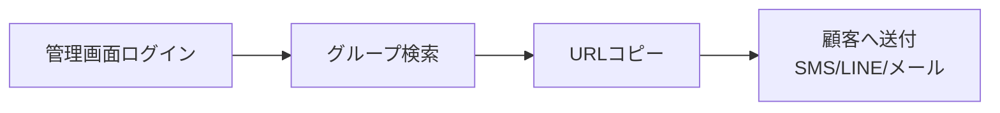
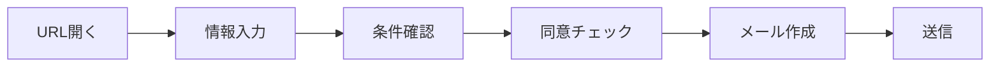

# ユーザーフロー

## 1. 営業側フロー



### 手順
1. 共通ID/PWで管理画面にログイン
2. 担当者名 or グループ名で検索
3. 対象プランの「コピー」ボタンをクリック
4. 電話口で「今送りますね」→ URL送付

**ポイント**: URLは毎回同じ。メモ帳保存不要。

## 2. 顧客側フロー



### ステップ詳細

| Step | 画面 | 顧客アクション |
|------|------|----------------|
| 1 | 入力 | 氏名・メール・契約開始日を入力 |
| 2 | 確認 | キャンペーン条件を読む |
| 3 | 同意 | 「理解しました」にチェック |
| 4 | メール | 「メールを作成」ボタン押下 |
| 5 | 送信 | メーラーが起動、送信ボタン |

## 3. データフロー

```
[顧客入力]
    ↓
[サーバー処理]
    - トークン検証
    - 日付計算（contract_start_date + X months）
    - テンプレート展開
    - 識別コード生成
    - submissions保存
    ↓
[mailto URL生成]
    ↓
[メーラー起動]
```

## 4. URL構造

### 顧客送付URL
```
https://example.com/p/{plan_slug}?u={token}
```

| パラメータ | 説明 | 例 |
|------------|------|-----|
| `plan_slug` | プラン識別子 | `plan-a` |
| `u` | グループトークン | `K8h2Qx9...` |

### 内部でのトークン解決
```
token → group → email（宛先）
```

## 5. エラーハンドリング

### 顧客画面

| 状況 | 表示 |
|------|------|
| トークン無効/期限切れ | 「リンクが無効です。送付元にご確認ください。」 |
| プラン無効 | 「このプランは現在受付停止中です。」 |
| 必須未入力 | 「未入力の項目があります。」 |
| 同意未チェック | 「同意チェックを入れてください。」 |

### mailto失敗時（代替導線）

画面に以下を表示：
- 宛先 [コピー]
- 件名 [コピー]
- 本文 [コピー]

```
上記内容をコピーし、ご自身のメールアプリから送信してください。
```
